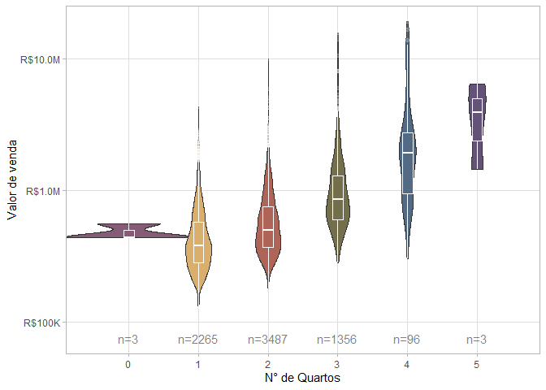
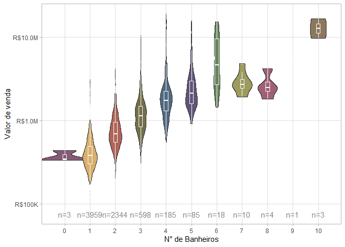
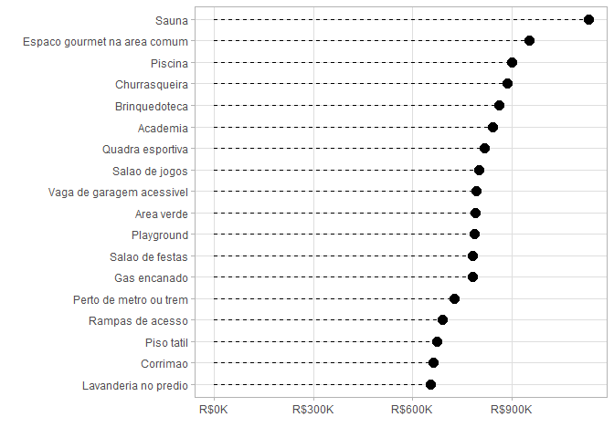

<!-- README.md is generated from README.Rmd. Please edit that file -->

# Análise Imóveis Quinto Andar

## Carregar pacotes e dados

``` r
library(tidyverse, quietly = TRUE)
#> ── Attaching core tidyverse packages ──────────────────────── tidyverse 2.0.0 ──
#> ✔ dplyr     1.1.4     ✔ readr     2.1.5
#> ✔ forcats   1.0.0     ✔ stringr   1.5.1
#> ✔ ggplot2   3.5.1     ✔ tibble    3.2.1
#> ✔ lubridate 1.9.3     ✔ tidyr     1.3.1
#> ✔ purrr     1.0.2     
#> ── Conflicts ────────────────────────────────────────── tidyverse_conflicts() ──
#> ✖ dplyr::filter() masks stats::filter()
#> ✖ dplyr::lag()    masks stats::lag()
#> ℹ Use the conflicted package (<http://conflicted.r-lib.org/>) to force all conflicts to become errors
library(tidytext)
library(gt)
library(gtExtras)

theme_set(
  theme_light() +
    theme(
      panel.grid.minor = element_blank()
    )
)

imoveis <- read_rds("dados/imoveis.rds") %>% 
  mutate(price_m2 = salePrice / area) %>% 
  relocate(price_m2, .after = id)
```

## Funções Úteis

``` r
escala_dinheiro <- scales::dollar_format(scale = 1e-6,
                                         suffix = "M")

comparar_grupos <- function(tbl, col, x_label = ""){
  col_expr <- enquo(col)
  
  tbl %>% 
    ggplot(aes(factor(!!col_expr), salePrice, fill = factor(!!col_expr))) +
    geom_violin(width = 1.8, show.legend = FALSE) +
    geom_boxplot(width = 0.15,
                 alpha = 0.2,
                 color = "white",
                 show.legend = FALSE) +
    scale_y_log10(labels = escala_dinheiro) +
    paletteer::scale_fill_paletteer_d("rcartocolor::Antique") +
    labs(x=x_label, y='Valor de venda')
}
```

## Relação de área do imóvel com valor de venda

``` r
imoveis %>% 
  filter(salePrice < 15e6) %>% 
  ggplot(aes(area, salePrice)) +
  geom_point(color = "brown", alpha = 0.2) +
  scale_y_log10(labels = escala_dinheiro) +
  scale_x_log10() +
  geom_smooth(method = "lm", color = "tomato", fill = "tomato", alpha = 0.2) +
  labs(x='Área', y='Preço do Imóvel')
#> `geom_smooth()` using formula = 'y ~ x'
```

<!-- -->

## Relação entre quantidade de quartos e preço do imóvel

``` r
imoveis %>% 
  comparar_grupos(bedrooms, x_label = "N° de Quartos")
#> Warning: `position_dodge()` requires non-overlapping x intervals.
```

<!-- -->

## Relação entre quantidade de banheiros e preço do imóvel

``` r
imoveis %>% 
  comparar_grupos(bathrooms, x_label = "N° de Banheiros")
#> Warning: Groups with fewer than two datapoints have been dropped.
#> ℹ Set `drop = FALSE` to consider such groups for position adjustment purposes.
#> Warning: `position_dodge()` requires non-overlapping x intervals.
```

<!-- -->

## Custo por região em SP

``` r
imoveis_por_regiao <- imoveis %>% 
  summarize(
    price_m2 = mean(price_m2),
    yield = mean(yield),
    n = n(),
    .by = regionName
  ) %>% 
  filter(n > 15) %>% 
  arrange(desc(price_m2)) 
  
imoveis_por_regiao %>% 
  gt(process_md = TRUE) %>% 
  cols_label(
    regionName = "Localização",
    price_m2   = "Preço do M²",
    yield      = "Rendimento do Imóvel",
    n          = "Quantidade"
  ) %>% 
  fmt_currency(
    columns = price_m2,
    decimals = 0,
    currency = "BRL"
  ) %>% 
  fmt_percent(
    columns = yield,
    decimals = 2,
    drop_trailing_zeros = TRUE
  ) %>%
  # tab_spanner(
  #   label = "Valores Medianos",
  #   columns = c(sale_price, total_cost)
  # ) %>% 
  tab_header(
    title = "Valor do m² de Apartamentos em diferentes regiões de SP"
  ) %>% 
  tab_source_note("Fonte: quintoandar.com.br") %>% 
  gt_theme_espn() 
```

<div id="zooqoaaofl" style="padding-left:0px;padding-right:0px;padding-top:10px;padding-bottom:10px;overflow-x:auto;overflow-y:auto;width:auto;height:auto;">
<style>@import url("https://fonts.googleapis.com/css2?family=Lato:ital,wght@0,100;0,200;0,300;0,400;0,500;0,600;0,700;0,800;0,900;1,100;1,200;1,300;1,400;1,500;1,600;1,700;1,800;1,900&display=swap");
#zooqoaaofl table {
  font-family: Lato, system-ui, 'Segoe UI', Roboto, Helvetica, Arial, sans-serif, 'Apple Color Emoji', 'Segoe UI Emoji', 'Segoe UI Symbol', 'Noto Color Emoji';
  -webkit-font-smoothing: antialiased;
  -moz-osx-font-smoothing: grayscale;
}
&#10;#zooqoaaofl thead, #zooqoaaofl tbody, #zooqoaaofl tfoot, #zooqoaaofl tr, #zooqoaaofl td, #zooqoaaofl th {
  border-style: none;
}
&#10;#zooqoaaofl p {
  margin: 0;
  padding: 0;
}
&#10;#zooqoaaofl .gt_table {
  display: table;
  border-collapse: collapse;
  line-height: normal;
  margin-left: auto;
  margin-right: auto;
  color: #333333;
  font-size: 16px;
  font-weight: normal;
  font-style: normal;
  background-color: #FFFFFF;
  width: auto;
  border-top-style: solid;
  border-top-width: 3px;
  border-top-color: #FFFFFF;
  border-right-style: none;
  border-right-width: 2px;
  border-right-color: #D3D3D3;
  border-bottom-style: solid;
  border-bottom-width: 2px;
  border-bottom-color: #A8A8A8;
  border-left-style: none;
  border-left-width: 2px;
  border-left-color: #D3D3D3;
}
&#10;#zooqoaaofl .gt_caption {
  padding-top: 4px;
  padding-bottom: 4px;
}
&#10;#zooqoaaofl .gt_title {
  color: #333333;
  font-size: 24px;
  font-weight: initial;
  padding-top: 4px;
  padding-bottom: 4px;
  padding-left: 5px;
  padding-right: 5px;
  border-bottom-color: #FFFFFF;
  border-bottom-width: 0;
}
&#10;#zooqoaaofl .gt_subtitle {
  color: #333333;
  font-size: 85%;
  font-weight: initial;
  padding-top: 3px;
  padding-bottom: 5px;
  padding-left: 5px;
  padding-right: 5px;
  border-top-color: #FFFFFF;
  border-top-width: 0;
}
&#10;#zooqoaaofl .gt_heading {
  background-color: #FFFFFF;
  text-align: left;
  border-bottom-color: #FFFFFF;
  border-left-style: none;
  border-left-width: 1px;
  border-left-color: #D3D3D3;
  border-right-style: none;
  border-right-width: 1px;
  border-right-color: #D3D3D3;
}
&#10;#zooqoaaofl .gt_bottom_border {
  border-bottom-style: solid;
  border-bottom-width: 2px;
  border-bottom-color: #D3D3D3;
}
&#10;#zooqoaaofl .gt_col_headings {
  border-top-style: solid;
  border-top-width: 2px;
  border-top-color: #D3D3D3;
  border-bottom-style: solid;
  border-bottom-width: 2px;
  border-bottom-color: #D3D3D3;
  border-left-style: none;
  border-left-width: 1px;
  border-left-color: #D3D3D3;
  border-right-style: none;
  border-right-width: 1px;
  border-right-color: #D3D3D3;
}
&#10;#zooqoaaofl .gt_col_heading {
  color: #333333;
  background-color: #FFFFFF;
  font-size: 80%;
  font-weight: bolder;
  text-transform: uppercase;
  border-left-style: none;
  border-left-width: 1px;
  border-left-color: #D3D3D3;
  border-right-style: none;
  border-right-width: 1px;
  border-right-color: #D3D3D3;
  vertical-align: bottom;
  padding-top: 5px;
  padding-bottom: 6px;
  padding-left: 5px;
  padding-right: 5px;
  overflow-x: hidden;
}
&#10;#zooqoaaofl .gt_column_spanner_outer {
  color: #333333;
  background-color: #FFFFFF;
  font-size: 80%;
  font-weight: bolder;
  text-transform: uppercase;
  padding-top: 0;
  padding-bottom: 0;
  padding-left: 4px;
  padding-right: 4px;
}
&#10;#zooqoaaofl .gt_column_spanner_outer:first-child {
  padding-left: 0;
}
&#10;#zooqoaaofl .gt_column_spanner_outer:last-child {
  padding-right: 0;
}
&#10;#zooqoaaofl .gt_column_spanner {
  border-bottom-style: solid;
  border-bottom-width: 2px;
  border-bottom-color: #D3D3D3;
  vertical-align: bottom;
  padding-top: 5px;
  padding-bottom: 5px;
  overflow-x: hidden;
  display: inline-block;
  width: 100%;
}
&#10;#zooqoaaofl .gt_spanner_row {
  border-bottom-style: hidden;
}
&#10;#zooqoaaofl .gt_group_heading {
  padding-top: 8px;
  padding-bottom: 8px;
  padding-left: 5px;
  padding-right: 5px;
  color: #333333;
  background-color: #FFFFFF;
  font-size: 80%;
  font-weight: bolder;
  text-transform: uppercase;
  border-top-style: solid;
  border-top-width: 2px;
  border-top-color: #D3D3D3;
  border-bottom-style: solid;
  border-bottom-width: 2px;
  border-bottom-color: #D3D3D3;
  border-left-style: none;
  border-left-width: 1px;
  border-left-color: #D3D3D3;
  border-right-style: none;
  border-right-width: 1px;
  border-right-color: #D3D3D3;
  vertical-align: middle;
  text-align: left;
}
&#10;#zooqoaaofl .gt_empty_group_heading {
  padding: 0.5px;
  color: #333333;
  background-color: #FFFFFF;
  font-size: 80%;
  font-weight: bolder;
  border-top-style: solid;
  border-top-width: 2px;
  border-top-color: #D3D3D3;
  border-bottom-style: solid;
  border-bottom-width: 2px;
  border-bottom-color: #D3D3D3;
  vertical-align: middle;
}
&#10;#zooqoaaofl .gt_from_md > :first-child {
  margin-top: 0;
}
&#10;#zooqoaaofl .gt_from_md > :last-child {
  margin-bottom: 0;
}
&#10;#zooqoaaofl .gt_row {
  padding-top: 7px;
  padding-bottom: 7px;
  padding-left: 5px;
  padding-right: 5px;
  margin: 10px;
  border-top-style: solid;
  border-top-width: 1px;
  border-top-color: #F6F7F7;
  border-left-style: none;
  border-left-width: 1px;
  border-left-color: #D3D3D3;
  border-right-style: none;
  border-right-width: 1px;
  border-right-color: #D3D3D3;
  vertical-align: middle;
  overflow-x: hidden;
}
&#10;#zooqoaaofl .gt_stub {
  color: #333333;
  background-color: #FFFFFF;
  font-size: 80%;
  font-weight: bolder;
  text-transform: uppercase;
  border-right-style: solid;
  border-right-width: 2px;
  border-right-color: #D3D3D3;
  padding-left: 5px;
  padding-right: 5px;
}
&#10;#zooqoaaofl .gt_stub_row_group {
  color: #333333;
  background-color: #FFFFFF;
  font-size: 100%;
  font-weight: initial;
  text-transform: inherit;
  border-right-style: solid;
  border-right-width: 2px;
  border-right-color: #D3D3D3;
  padding-left: 5px;
  padding-right: 5px;
  vertical-align: top;
}
&#10;#zooqoaaofl .gt_row_group_first td {
  border-top-width: 2px;
}
&#10;#zooqoaaofl .gt_row_group_first th {
  border-top-width: 2px;
}
&#10;#zooqoaaofl .gt_summary_row {
  color: #333333;
  background-color: #FFFFFF;
  text-transform: inherit;
  padding-top: 8px;
  padding-bottom: 8px;
  padding-left: 5px;
  padding-right: 5px;
}
&#10;#zooqoaaofl .gt_first_summary_row {
  border-top-style: solid;
  border-top-color: #D3D3D3;
}
&#10;#zooqoaaofl .gt_first_summary_row.thick {
  border-top-width: 2px;
}
&#10;#zooqoaaofl .gt_last_summary_row {
  padding-top: 8px;
  padding-bottom: 8px;
  padding-left: 5px;
  padding-right: 5px;
  border-bottom-style: solid;
  border-bottom-width: 2px;
  border-bottom-color: #D3D3D3;
}
&#10;#zooqoaaofl .gt_grand_summary_row {
  color: #333333;
  background-color: #FFFFFF;
  text-transform: inherit;
  padding-top: 8px;
  padding-bottom: 8px;
  padding-left: 5px;
  padding-right: 5px;
}
&#10;#zooqoaaofl .gt_first_grand_summary_row {
  padding-top: 8px;
  padding-bottom: 8px;
  padding-left: 5px;
  padding-right: 5px;
  border-top-style: double;
  border-top-width: 6px;
  border-top-color: #D3D3D3;
}
&#10;#zooqoaaofl .gt_last_grand_summary_row_top {
  padding-top: 8px;
  padding-bottom: 8px;
  padding-left: 5px;
  padding-right: 5px;
  border-bottom-style: double;
  border-bottom-width: 6px;
  border-bottom-color: #D3D3D3;
}
&#10;#zooqoaaofl .gt_striped {
  background-color: #FAFAFA;
}
&#10;#zooqoaaofl .gt_table_body {
  border-top-style: solid;
  border-top-width: 2px;
  border-top-color: #D3D3D3;
  border-bottom-style: solid;
  border-bottom-width: 2px;
  border-bottom-color: #D3D3D3;
}
&#10;#zooqoaaofl .gt_footnotes {
  color: #333333;
  background-color: #FFFFFF;
  border-bottom-style: none;
  border-bottom-width: 2px;
  border-bottom-color: #D3D3D3;
  border-left-style: none;
  border-left-width: 2px;
  border-left-color: #D3D3D3;
  border-right-style: none;
  border-right-width: 2px;
  border-right-color: #D3D3D3;
}
&#10;#zooqoaaofl .gt_footnote {
  margin: 0px;
  font-size: 90%;
  padding-top: 4px;
  padding-bottom: 4px;
  padding-left: 5px;
  padding-right: 5px;
}
&#10;#zooqoaaofl .gt_sourcenotes {
  color: #333333;
  background-color: #FFFFFF;
  border-bottom-style: none;
  border-bottom-width: 2px;
  border-bottom-color: #D3D3D3;
  border-left-style: none;
  border-left-width: 2px;
  border-left-color: #D3D3D3;
  border-right-style: none;
  border-right-width: 2px;
  border-right-color: #D3D3D3;
}
&#10;#zooqoaaofl .gt_sourcenote {
  font-size: 12px;
  padding-top: 4px;
  padding-bottom: 4px;
  padding-left: 5px;
  padding-right: 5px;
}
&#10;#zooqoaaofl .gt_left {
  text-align: left;
}
&#10;#zooqoaaofl .gt_center {
  text-align: center;
}
&#10;#zooqoaaofl .gt_right {
  text-align: right;
  font-variant-numeric: tabular-nums;
}
&#10;#zooqoaaofl .gt_font_normal {
  font-weight: normal;
}
&#10;#zooqoaaofl .gt_font_bold {
  font-weight: bold;
}
&#10;#zooqoaaofl .gt_font_italic {
  font-style: italic;
}
&#10;#zooqoaaofl .gt_super {
  font-size: 65%;
}
&#10;#zooqoaaofl .gt_footnote_marks {
  font-size: 75%;
  vertical-align: 0.4em;
  position: initial;
}
&#10;#zooqoaaofl .gt_asterisk {
  font-size: 100%;
  vertical-align: 0;
}
&#10;#zooqoaaofl .gt_indent_1 {
  text-indent: 5px;
}
&#10;#zooqoaaofl .gt_indent_2 {
  text-indent: 10px;
}
&#10;#zooqoaaofl .gt_indent_3 {
  text-indent: 15px;
}
&#10;#zooqoaaofl .gt_indent_4 {
  text-indent: 20px;
}
&#10;#zooqoaaofl .gt_indent_5 {
  text-indent: 25px;
}
</style>
<table class="gt_table" data-quarto-disable-processing="false" data-quarto-bootstrap="false">
  <thead>
    <tr class="gt_heading">
      <td colspan="4" class="gt_heading gt_title gt_font_normal gt_bottom_border" style>Valor do m² de Apartamentos em diferentes regiões de SP</td>
    </tr>
    &#10;    <tr class="gt_col_headings">
      <th class="gt_col_heading gt_columns_bottom_border gt_left" rowspan="1" colspan="1" scope="col" id="Localização">Localização</th>
      <th class="gt_col_heading gt_columns_bottom_border gt_right" rowspan="1" colspan="1" scope="col" id="Preço do M²">Preço do M²</th>
      <th class="gt_col_heading gt_columns_bottom_border gt_right" rowspan="1" colspan="1" scope="col" id="Rendimento do Imóvel">Rendimento do Imóvel</th>
      <th class="gt_col_heading gt_columns_bottom_border gt_right" rowspan="1" colspan="1" scope="col" id="Quantidade">Quantidade</th>
    </tr>
  </thead>
  <tbody class="gt_table_body">
    <tr><td headers="regionName" class="gt_row gt_left">Vila Nova Conceição</td>
<td headers="price_m2" class="gt_row gt_right">R$23,104</td>
<td headers="yield" class="gt_row gt_right">0.32%</td>
<td headers="n" class="gt_row gt_right">18</td></tr>
    <tr><td headers="regionName" class="gt_row gt_left gt_striped">Vila Olímpia</td>
<td headers="price_m2" class="gt_row gt_right gt_striped">R$18,184</td>
<td headers="yield" class="gt_row gt_right gt_striped">0.42%</td>
<td headers="n" class="gt_row gt_right gt_striped">74</td></tr>
    <tr><td headers="regionName" class="gt_row gt_left">Itaim Bibi</td>
<td headers="price_m2" class="gt_row gt_right">R$16,496</td>
<td headers="yield" class="gt_row gt_right">0.39%</td>
<td headers="n" class="gt_row gt_right">56</td></tr>
    <tr><td headers="regionName" class="gt_row gt_left gt_striped">Pinheiros</td>
<td headers="price_m2" class="gt_row gt_right gt_striped">R$16,229</td>
<td headers="yield" class="gt_row gt_right gt_striped">0.42%</td>
<td headers="n" class="gt_row gt_right gt_striped">182</td></tr>
    <tr><td headers="regionName" class="gt_row gt_left">Brooklin</td>
<td headers="price_m2" class="gt_row gt_right">R$15,884</td>
<td headers="yield" class="gt_row gt_right">0.44%</td>
<td headers="n" class="gt_row gt_right">133</td></tr>
    <tr><td headers="regionName" class="gt_row gt_left gt_striped">Moema</td>
<td headers="price_m2" class="gt_row gt_right gt_striped">R$15,791</td>
<td headers="yield" class="gt_row gt_right gt_striped">0.42%</td>
<td headers="n" class="gt_row gt_right gt_striped">110</td></tr>
    <tr><td headers="regionName" class="gt_row gt_left">Jardim Paulista</td>
<td headers="price_m2" class="gt_row gt_right">R$15,648</td>
<td headers="yield" class="gt_row gt_right">0.38%</td>
<td headers="n" class="gt_row gt_right">130</td></tr>
    <tr><td headers="regionName" class="gt_row gt_left gt_striped">Vila Madalena</td>
<td headers="price_m2" class="gt_row gt_right gt_striped">R$14,220</td>
<td headers="yield" class="gt_row gt_right gt_striped">0.41%</td>
<td headers="n" class="gt_row gt_right gt_striped">53</td></tr>
    <tr><td headers="regionName" class="gt_row gt_left">Campo Belo</td>
<td headers="price_m2" class="gt_row gt_right">R$13,727</td>
<td headers="yield" class="gt_row gt_right">0.42%</td>
<td headers="n" class="gt_row gt_right">51</td></tr>
    <tr><td headers="regionName" class="gt_row gt_left gt_striped">Paraíso</td>
<td headers="price_m2" class="gt_row gt_right gt_striped">R$13,019</td>
<td headers="yield" class="gt_row gt_right gt_striped">0.38%</td>
<td headers="n" class="gt_row gt_right gt_striped">58</td></tr>
    <tr><td headers="regionName" class="gt_row gt_left">Sumaré</td>
<td headers="price_m2" class="gt_row gt_right">R$12,971</td>
<td headers="yield" class="gt_row gt_right">0.43%</td>
<td headers="n" class="gt_row gt_right">44</td></tr>
    <tr><td headers="regionName" class="gt_row gt_left gt_striped">Vila Mariana</td>
<td headers="price_m2" class="gt_row gt_right gt_striped">R$12,507</td>
<td headers="yield" class="gt_row gt_right gt_striped">0.46%</td>
<td headers="n" class="gt_row gt_right gt_striped">274</td></tr>
    <tr><td headers="regionName" class="gt_row gt_left">Vila Clementino</td>
<td headers="price_m2" class="gt_row gt_right">R$12,483</td>
<td headers="yield" class="gt_row gt_right">0.47%</td>
<td headers="n" class="gt_row gt_right">54</td></tr>
    <tr><td headers="regionName" class="gt_row gt_left gt_striped">Vila Pompéia</td>
<td headers="price_m2" class="gt_row gt_right gt_striped">R$12,298</td>
<td headers="yield" class="gt_row gt_right gt_striped">0.43%</td>
<td headers="n" class="gt_row gt_right gt_striped">95</td></tr>
    <tr><td headers="regionName" class="gt_row gt_left">Vila Romana</td>
<td headers="price_m2" class="gt_row gt_right">R$11,849</td>
<td headers="yield" class="gt_row gt_right">0.44%</td>
<td headers="n" class="gt_row gt_right">23</td></tr>
    <tr><td headers="regionName" class="gt_row gt_left gt_striped">Perdizes</td>
<td headers="price_m2" class="gt_row gt_right gt_striped">R$11,812</td>
<td headers="yield" class="gt_row gt_right gt_striped">0.38%</td>
<td headers="n" class="gt_row gt_right gt_striped">97</td></tr>
    <tr><td headers="regionName" class="gt_row gt_left">Higienópolis</td>
<td headers="price_m2" class="gt_row gt_right">R$11,378</td>
<td headers="yield" class="gt_row gt_right">0.36%</td>
<td headers="n" class="gt_row gt_right">37</td></tr>
    <tr><td headers="regionName" class="gt_row gt_left gt_striped">Água Branca</td>
<td headers="price_m2" class="gt_row gt_right gt_striped">R$11,352</td>
<td headers="yield" class="gt_row gt_right gt_striped">0.52%</td>
<td headers="n" class="gt_row gt_right gt_striped">93</td></tr>
    <tr><td headers="regionName" class="gt_row gt_left">Chácara Inglesa</td>
<td headers="price_m2" class="gt_row gt_right">R$10,993</td>
<td headers="yield" class="gt_row gt_right">0.46%</td>
<td headers="n" class="gt_row gt_right">92</td></tr>
    <tr><td headers="regionName" class="gt_row gt_left gt_striped">Barra Funda</td>
<td headers="price_m2" class="gt_row gt_right gt_striped">R$10,803</td>
<td headers="yield" class="gt_row gt_right gt_striped">0.48%</td>
<td headers="n" class="gt_row gt_right gt_striped">230</td></tr>
    <tr><td headers="regionName" class="gt_row gt_left">Consolação</td>
<td headers="price_m2" class="gt_row gt_right">R$10,754</td>
<td headers="yield" class="gt_row gt_right">0.48%</td>
<td headers="n" class="gt_row gt_right">310</td></tr>
    <tr><td headers="regionName" class="gt_row gt_left gt_striped">Saúde</td>
<td headers="price_m2" class="gt_row gt_right gt_striped">R$10,450</td>
<td headers="yield" class="gt_row gt_right gt_striped">0.42%</td>
<td headers="n" class="gt_row gt_right gt_striped">70</td></tr>
    <tr><td headers="regionName" class="gt_row gt_left">Tatuapé</td>
<td headers="price_m2" class="gt_row gt_right">R$10,231</td>
<td headers="yield" class="gt_row gt_right">0.46%</td>
<td headers="n" class="gt_row gt_right">170</td></tr>
    <tr><td headers="regionName" class="gt_row gt_left gt_striped">Ipiranga</td>
<td headers="price_m2" class="gt_row gt_right gt_striped">R$9,958</td>
<td headers="yield" class="gt_row gt_right gt_striped">0.47%</td>
<td headers="n" class="gt_row gt_right gt_striped">218</td></tr>
    <tr><td headers="regionName" class="gt_row gt_left">Água Fria</td>
<td headers="price_m2" class="gt_row gt_right">R$9,648</td>
<td headers="yield" class="gt_row gt_right">0.49%</td>
<td headers="n" class="gt_row gt_right">68</td></tr>
    <tr><td headers="regionName" class="gt_row gt_left gt_striped">Vila Maria </td>
<td headers="price_m2" class="gt_row gt_right gt_striped">R$9,229</td>
<td headers="yield" class="gt_row gt_right gt_striped">0.43%</td>
<td headers="n" class="gt_row gt_right gt_striped">22</td></tr>
    <tr><td headers="regionName" class="gt_row gt_left">Jardim Anália Franco</td>
<td headers="price_m2" class="gt_row gt_right">R$9,153</td>
<td headers="yield" class="gt_row gt_right">0.45%</td>
<td headers="n" class="gt_row gt_right">46</td></tr>
    <tr><td headers="regionName" class="gt_row gt_left gt_striped">Santa Cecília</td>
<td headers="price_m2" class="gt_row gt_right gt_striped">R$9,124</td>
<td headers="yield" class="gt_row gt_right gt_striped">0.46%</td>
<td headers="n" class="gt_row gt_right gt_striped">347</td></tr>
    <tr><td headers="regionName" class="gt_row gt_left">Bosque da Saúde</td>
<td headers="price_m2" class="gt_row gt_right">R$9,086</td>
<td headers="yield" class="gt_row gt_right">0.48%</td>
<td headers="n" class="gt_row gt_right">154</td></tr>
    <tr><td headers="regionName" class="gt_row gt_left gt_striped">Bela Vista</td>
<td headers="price_m2" class="gt_row gt_right gt_striped">R$9,020</td>
<td headers="yield" class="gt_row gt_right gt_striped">0.49%</td>
<td headers="n" class="gt_row gt_right gt_striped">400</td></tr>
    <tr><td headers="regionName" class="gt_row gt_left">Belém</td>
<td headers="price_m2" class="gt_row gt_right">R$8,841</td>
<td headers="yield" class="gt_row gt_right">0.5%</td>
<td headers="n" class="gt_row gt_right">208</td></tr>
    <tr><td headers="regionName" class="gt_row gt_left gt_striped">Aclimação</td>
<td headers="price_m2" class="gt_row gt_right gt_striped">R$8,719</td>
<td headers="yield" class="gt_row gt_right gt_striped">0.46%</td>
<td headers="n" class="gt_row gt_right gt_striped">159</td></tr>
    <tr><td headers="regionName" class="gt_row gt_left">Mooca</td>
<td headers="price_m2" class="gt_row gt_right">R$8,624</td>
<td headers="yield" class="gt_row gt_right">0.5%</td>
<td headers="n" class="gt_row gt_right">762</td></tr>
    <tr><td headers="regionName" class="gt_row gt_left gt_striped">Vila Santa Clara</td>
<td headers="price_m2" class="gt_row gt_right gt_striped">R$8,613</td>
<td headers="yield" class="gt_row gt_right gt_striped">0.46%</td>
<td headers="n" class="gt_row gt_right gt_striped">16</td></tr>
    <tr><td headers="regionName" class="gt_row gt_left">Santana</td>
<td headers="price_m2" class="gt_row gt_right">R$8,564</td>
<td headers="yield" class="gt_row gt_right">0.46%</td>
<td headers="n" class="gt_row gt_right">247</td></tr>
    <tr><td headers="regionName" class="gt_row gt_left gt_striped">Vila Prudente</td>
<td headers="price_m2" class="gt_row gt_right gt_striped">R$8,490</td>
<td headers="yield" class="gt_row gt_right gt_striped">0.49%</td>
<td headers="n" class="gt_row gt_right gt_striped">146</td></tr>
    <tr><td headers="regionName" class="gt_row gt_left">Cambuci</td>
<td headers="price_m2" class="gt_row gt_right">R$8,056</td>
<td headers="yield" class="gt_row gt_right">0.51%</td>
<td headers="n" class="gt_row gt_right">350</td></tr>
    <tr><td headers="regionName" class="gt_row gt_left gt_striped">Casa Verde</td>
<td headers="price_m2" class="gt_row gt_right gt_striped">R$8,005</td>
<td headers="yield" class="gt_row gt_right gt_striped">0.49%</td>
<td headers="n" class="gt_row gt_right gt_striped">116</td></tr>
    <tr><td headers="regionName" class="gt_row gt_left">Vila Guilherme</td>
<td headers="price_m2" class="gt_row gt_right">R$7,878</td>
<td headers="yield" class="gt_row gt_right">0.49%</td>
<td headers="n" class="gt_row gt_right">122</td></tr>
    <tr><td headers="regionName" class="gt_row gt_left gt_striped">Mandaqui</td>
<td headers="price_m2" class="gt_row gt_right gt_striped">R$7,872</td>
<td headers="yield" class="gt_row gt_right gt_striped">0.44%</td>
<td headers="n" class="gt_row gt_right gt_striped">31</td></tr>
    <tr><td headers="regionName" class="gt_row gt_left">Canindé</td>
<td headers="price_m2" class="gt_row gt_right">R$7,871</td>
<td headers="yield" class="gt_row gt_right">0.52%</td>
<td headers="n" class="gt_row gt_right">24</td></tr>
    <tr><td headers="regionName" class="gt_row gt_left gt_striped">Bom Retiro</td>
<td headers="price_m2" class="gt_row gt_right gt_striped">R$7,361</td>
<td headers="yield" class="gt_row gt_right gt_striped">0.53%</td>
<td headers="n" class="gt_row gt_right gt_striped">139</td></tr>
    <tr><td headers="regionName" class="gt_row gt_left">Vila das Mercês</td>
<td headers="price_m2" class="gt_row gt_right">R$7,283</td>
<td headers="yield" class="gt_row gt_right">0.53%</td>
<td headers="n" class="gt_row gt_right">69</td></tr>
    <tr><td headers="regionName" class="gt_row gt_left gt_striped">Freguesia do Ó</td>
<td headers="price_m2" class="gt_row gt_right gt_striped">R$7,280</td>
<td headers="yield" class="gt_row gt_right gt_striped">0.48%</td>
<td headers="n" class="gt_row gt_right gt_striped">34</td></tr>
    <tr><td headers="regionName" class="gt_row gt_left">Liberdade</td>
<td headers="price_m2" class="gt_row gt_right">R$7,174</td>
<td headers="yield" class="gt_row gt_right">0.52%</td>
<td headers="n" class="gt_row gt_right">410</td></tr>
    <tr><td headers="regionName" class="gt_row gt_left gt_striped">Brás</td>
<td headers="price_m2" class="gt_row gt_right gt_striped">R$7,002</td>
<td headers="yield" class="gt_row gt_right gt_striped">0.52%</td>
<td headers="n" class="gt_row gt_right gt_striped">115</td></tr>
    <tr><td headers="regionName" class="gt_row gt_left">Campos Elíseos</td>
<td headers="price_m2" class="gt_row gt_right">R$6,976</td>
<td headers="yield" class="gt_row gt_right">0.47%</td>
<td headers="n" class="gt_row gt_right">92</td></tr>
    <tr><td headers="regionName" class="gt_row gt_left gt_striped">Vila Roque</td>
<td headers="price_m2" class="gt_row gt_right gt_striped">R$6,644</td>
<td headers="yield" class="gt_row gt_right gt_striped">0.48%</td>
<td headers="n" class="gt_row gt_right gt_striped">18</td></tr>
    <tr><td headers="regionName" class="gt_row gt_left">Centro</td>
<td headers="price_m2" class="gt_row gt_right">R$6,413</td>
<td headers="yield" class="gt_row gt_right">0.49%</td>
<td headers="n" class="gt_row gt_right">212</td></tr>
    <tr><td headers="regionName" class="gt_row gt_left gt_striped">Parque Novo Mundo </td>
<td headers="price_m2" class="gt_row gt_right gt_striped">R$5,842</td>
<td headers="yield" class="gt_row gt_right gt_striped">0.5%</td>
<td headers="n" class="gt_row gt_right gt_striped">30</td></tr>
    <tr><td headers="regionName" class="gt_row gt_left">Sacomã</td>
<td headers="price_m2" class="gt_row gt_right">R$5,837</td>
<td headers="yield" class="gt_row gt_right">0.52%</td>
<td headers="n" class="gt_row gt_right">36</td></tr>
  </tbody>
  <tfoot class="gt_sourcenotes">
    <tr>
      <td class="gt_sourcenote" colspan="4">Fonte: quintoandar.com.br</td>
    </tr>
  </tfoot>
  &#10;</table>
</div>

## Preço médio por unidade de instalação no predio

``` r
library(tidytext)
imoveis %>% 
  unnest_tokens(palavra, installations) %>% 
  summarize(
    sale_price = mean(salePrice),
    .by = palavra
  ) %>% 
  mutate(palavra = fct_reorder(palavra, sale_price)) %>% 
  ggplot(aes(palavra, sale_price)) + 
  geom_segment(aes(x=palavra, xend=palavra, y=0, yend=sale_price),
               lty = 2) +
  geom_point(size = 3.6) +
  scale_y_continuous(labels = escala_dinheiro) +
  coord_flip() +
  labs(x='', y='')
```

<!-- --> \## Preço de
venda do imóvel X Rendimento do Aluguel

``` r
imoveis %>% 
  ggplot(aes(yield, price_m2)) +
  geom_point(size = 2.2, alpha = 0.3, color = "#824D74") +
  scale_y_continuous(labels = scales::dollar_format()) +
  scale_x_continuous(labels = scales::percent_format()) +
  geom_smooth(method = "loess", color = "#401F71") +
  labs(x='Rentabilidade do imóvel', y='Preço m²')
#> `geom_smooth()` using formula = 'y ~ x'
```

<!-- -->
